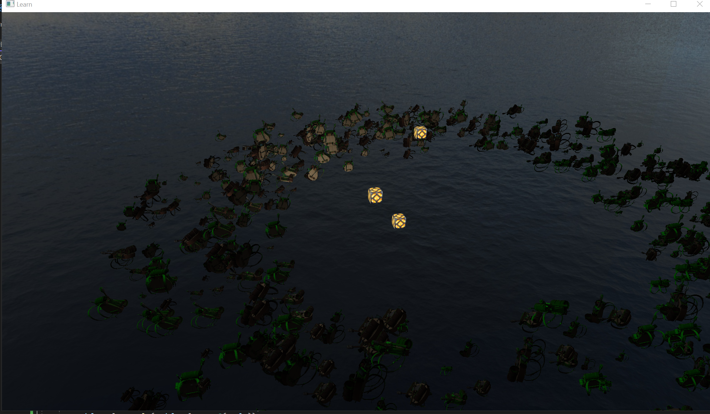
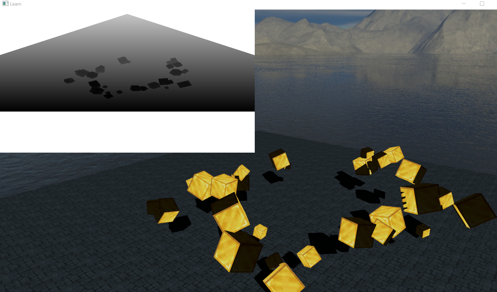

# OpenGL Fun!
## Goal is to slowly build a 3D renderer, with learned concepts. 
Currently use this repository for the implementation of learned concepts and fun graphics side projects. 
Optimization is always in mind! Eventually wanting to restructure into a static library to act as a rendering engine for future hobby projects. 
### Current / planned features include:
- Model Loading/Rendering with Assimp (https://github.com/assimp/assimp)
- Model Lighting (Diffuse + Specular Maps, Ambient/Diffuse/Specular Intensity, Normal Maps (TODO), Roughness Maps (TODO), Emission Maps (TODO))
- Multithreaded Texture Loading
- Basic 3D Perspective Projection Camera
- Skyboxes
- Basic Shape Rendering (Cube, Plane (TODO), Sphere (TODO), Editor (TODO))
- Basic Lighting, Lighting Editor (TODO)
- UI system (TODO)
- Framebuffer system (TODO)
- Shadows (TODO)
- Stencil buffer system (TODO)
- More camera options (Orthographic, Isometric etc...) (TODO)
- Advanced Lighting (HDR, Bloom, etc...) (TODO)
- Blending support (for transparent and semi-transparent textures) (TODO)
- AND MORE!

## Work Showcases:

Cube screensaver (Beginning with 3d graphics)

Phong lighting demo (Lighting)

Lighting maps (diffuse, specular textures)

Skybox (cubemap texture) + environment mapping demo (environment reflection)

Game object instancing (models, lights, primitives, etc..)

Framebuffer system

Directional Light Shadows

