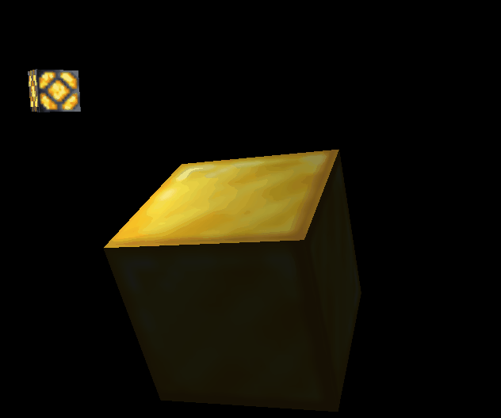

# OpenGL Fun!
## Goal is to slowly build a 3D renderer, with learned concepts. 
Currently use this repository for the implementation of learned concepts and fun graphics side projects. 
Optimization is always in mind! Eventually wanting to restructure into a static library to act as a rendering engine for future hobby projects. 
### Current / planned features include:
- Model Loading/Rendering (Batched vertex attributes)
- Model Material Rendering (Complete w/ diffuse, specular and height (ambient) maps)
- Basic 3d Camera System
- Skyboxes, Reflectivity
- Basic Shape Rendering (Cube, Plane (TODO), Sphere (TODO))
- Texture Loading System and Rendering
- Lighting (Point lighting, Spotlight (TODO), Directional Light)
- Basic custom material generation (colors) (TODO)
- UI system (TODO)
- Framebuffer system (TODO)
- Shadows (TODO)
- Stencil buffer system (TODO)
- More camera options (Orthographic, Isometric etc...) (TODO)
- Advanced Lighting (HDR, Bloom, etc...) (TODO)
- Blending support (for transparent and semi-transparent textures) (TODO)
- AND MORE!

## Work Showcases:

Cube screensaver (Beginning with 3d graphics)

Phong lighting demo (Lighting)

Lighting maps (diffuse, specular textures)

Model loading, rendering and stencil buffer showcase

Skybox (cubemap texture) + environment mapping demo (environment reflection)

